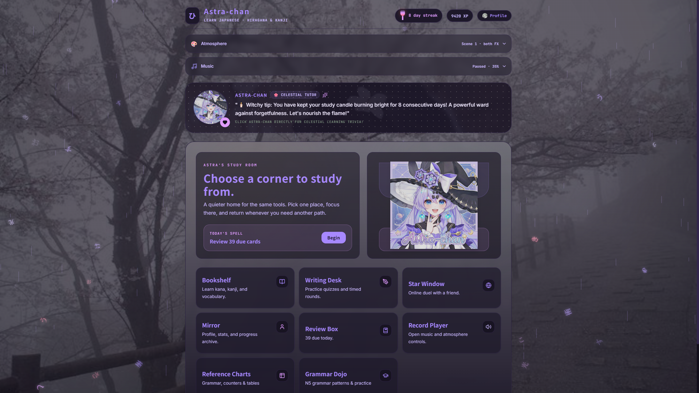
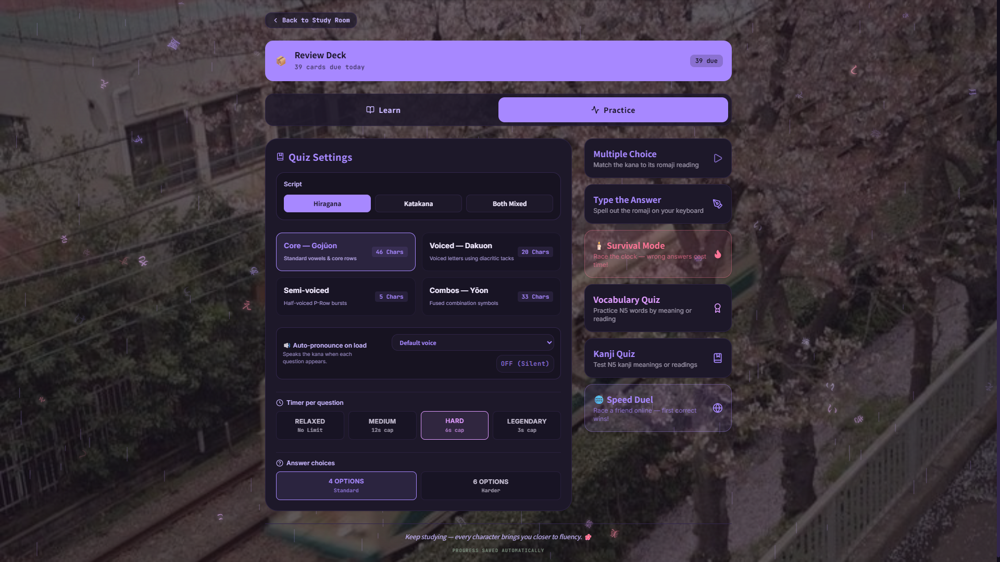
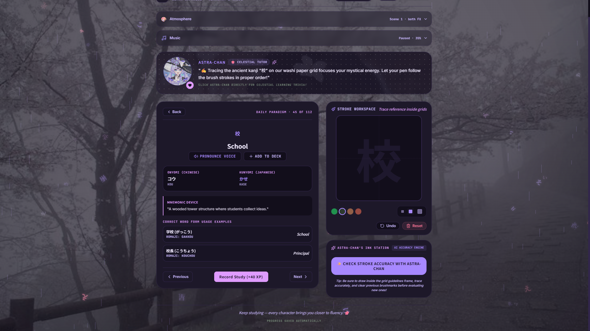
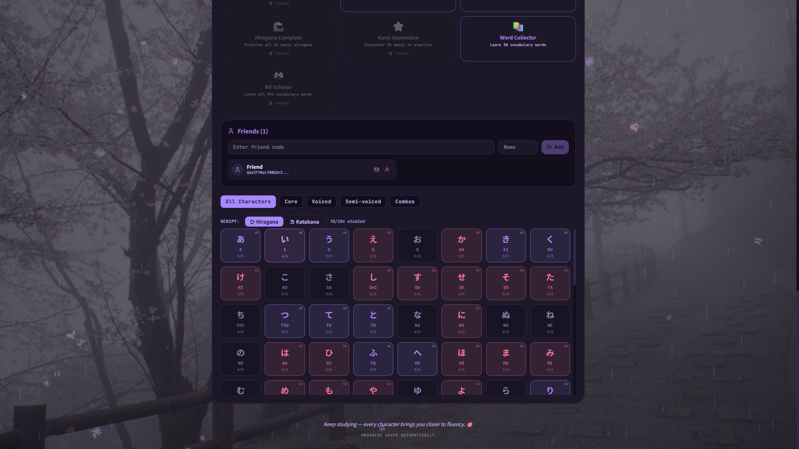
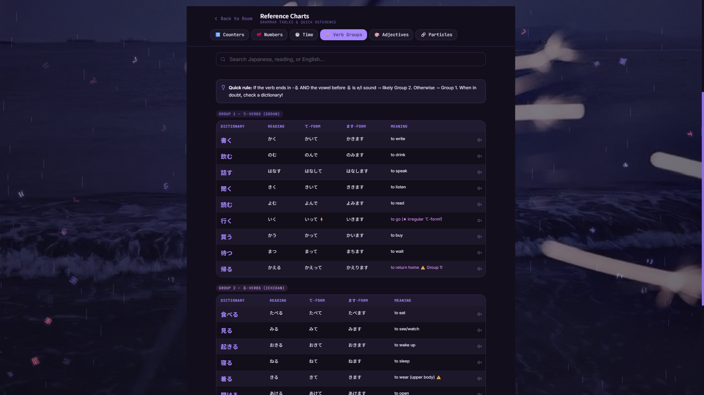
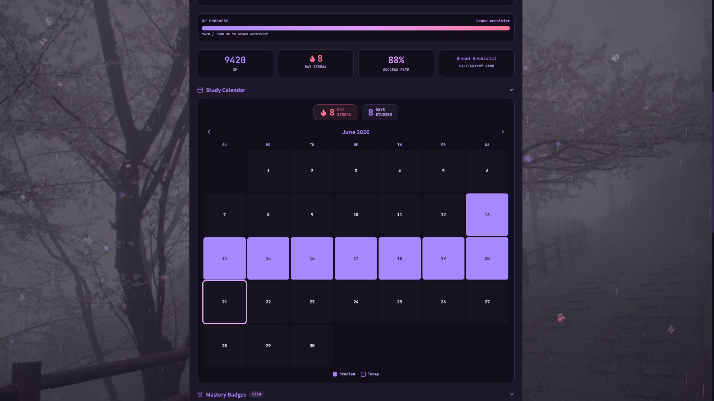

# 🌸 Astra-chan — Japanese Learning App

> *A cozy, magical Japanese learning companion. Built by two friends with a dream.*

**Live App → [astra-kanji-tutor.vercel.app](https://astra-kanji-tutor.vercel.app)**  
**GitHub → [github.com/late-shine/astra-chan-app](https://github.com/late-shine/astra-chan-app)**



---

## The Story

This didn't start as a project. It started as a problem.

Me and my friend had just begun learning Japanese. We were using videos and programs, but none of them felt fun enough to stick with. So we thought — what if we just built our own quiz?

I asked Claude to make a simple HTML file with a hiragana quiz, a timer, and some sound effects. It did. We called it **Hira-chan**. It was basic, but it was ours. We used it. Then my friend said: *"What if we make it bigger?"*

That question is why this app exists.

What followed was about a week of building — roughly 4 to 5 hours every day, sometimes more. I got completely addicted to it. Breaking things, fixing them, adding features, redesigning them, breaking them again. By the time I uploaded it to GitHub, around 8 days had passed. Not months. One focused, obsessive week.

I never wrote the code myself. But I decided what to build, how it should feel, what was worth adding and what wasn't, when something looked wrong, and how to fix it. I learned that knowing *what to ask* is its own skill.

The app grew from a single HTML file into a full-stack web application with multiplayer, AI-graded kanji drawing, a spaced repetition system, Firebase real-time database, grammar reference charts, and a mascot companion named **Astra-chan** — whose artwork was generated by Gemini after many, many attempts.

Some moments worth mentioning:

- When the background images and music came together for the first time, something clicked. It stopped feeling like a quiz app and started feeling like a *place*.
- The two-Claude strategy — using one Claude account to review the codebase and write a targeted prompt, then feeding that prompt to a second Claude with only the relevant files — was something I figured out to work around daily usage limits. It became how I managed every major feature.
- Kimi became the dedicated debugging AI almost by accident. It analyzed everything, found 70+ bugs, and when its HTML tool failed it automatically switched to Python. That impressed me enough to keep it as the dedicated bug-finder.
- The multiplayer system took the longest. I verified Gemini's Firebase instructions with DeepSeek before trusting them. I used Perplexity to find out how to secure API keys. I used ChatGPT and Gemini together to guide the Vercel deployment. Nothing was done with one tool.
- The Study Room redesign changed everything. Instead of menus and tabs, the home screen became Astra-chan's room — a Bookshelf, a Writing Desk, a Star Window. Navigation as a place to be, not a list to scroll through.
- Astra-chan now reacts when you go AFK. She wonders about you after 15 seconds of silence, and lights up when you return. Small thing. Feels alive.

This is still being built. It probably always will be.

---

## Why We Built This

Me and my friend are 18-year-old CST diploma students from Bangladesh. We're planning to move to Japan — not for a career reason alone, but because Japan represents something we both needed: a quieter life, beautiful nature, a place to breathe. We're aiming for MEXT scholarship and KOSEN admission. We're learning Japanese seriously.

Building a Japanese learning app while learning Japanese felt like the most honest thing we could do.

---

## Features

### 🏠 Study Room Navigation
The home screen is Astra-chan's room — each object is a destination:
- **Bookshelf** — Learn hiragana, katakana, kanji, and vocabulary
- **Writing Desk** — Practice quizzes and timed rounds
- **Star Window** — Online duel with a friend
- **Mirror** — Profile, stats, and progress archive
- **Review Box** — SRS review deck with live due card count
- **Record Player** — Music and atmosphere controls
- **Reference Charts** — Grammar tables and quick reference
- **Grammar Dojo** — N5 grammar patterns and practice

### 📚 Learning
- **Hiragana & Katakana** — full character grids with pronunciation, flashcard mode, and example words
- **Kanji** — 100 N5-level kanji with meanings, readings, stroke count, and example sentences
- **N5 Vocabulary** — 720+ words across 11 categories (greetings, food, places, actions, adjectives, body, weather, and more)
- **Daily Spell** — a suggested next action shown on the home screen each session

### 🎯 Practice & Quiz
- **Multiple quiz modes** — multiple choice, romaji typing, survival timer
- **Custom character picker** — select exactly which characters to quiz on, with per-row select/deselect
- **Quiz length selector** — 10 / 20 / 30 / All selected
- **Vocab Quiz** — meaning mode and reading mode with 4-choice answers
- **Kanji Quiz** — meaning mode and reading mode, no category hints (so it actually tests knowledge)
- **Kanji Drawing** — draw kanji on a canvas; graded by AI for stroke accuracy

<p align="center">
  
  
</p>

### 📖 Grammar Dojo
- 12 core N5 grammar patterns with full explanations
- Expandable cards showing structure, 3 example sentences, and tips
- Fill-in-the-blank practice quiz mode
- Search and filter by level (Basic / Intermediate)
- Romaji toggle for beginners who haven't mastered kanji yet
- Pronunciation for every example sentence

### 📊 Reference Charts
- **Counters** — all 12 N5 counters with sound change rules
- **Numbers** — two counting systems, the tricky 4/7/9 problem, large numbers
- **Time** — days of week, months, irregular days of month, ふん vs ぷん
- **Verb Groups** — all 3 groups with て-form and ます-form
- **Adjectives** — い vs な conjugation tables with common mistakes
- **Particles** — は/が/を/に/で/へ/の/と/も/から/まで with examples
- Search bar, romaji toggle, and 🔊 pronunciation on every row



### 🔁 Spaced Repetition (SRS)
- Add any word or kanji to your personal Review Deck
- Cards resurface on a 6-level interval system (8h → 1d → 3d → 7d → 14d → 30d)
- Wrong answers pull cards back; correct answers push them forward
- Due count shown live on the home screen Review Box
- XP awarded for every card reviewed

### 🌐 Online Multiplayer
- Create or join rooms with a 6-character room code
- **Competitive mode** — same question for both players; first correct answer steals the point
- **Parallel mode** — each player answers independently; winner decided by accuracy % and average speed
- Custom character picker for online rooms
- Configurable question count (10 / 20 / 30 / All)
- Configurable difficulty (Easy 15s / Medium 10s / Hard 5s / Super Hard 3s)
- Friend system with invite codes
- Live lobby with player avatars and online/offline status dots

### 👤 Profile & Progress
- XP system with levels
- Study streak tracking with monthly calendar view
- 10 mastery badges (First Steps, Survivor, Week Warrior, Deck Master, N5 Scholar, and more)
- Progress backup — download stats as JSON, restore anytime
- Voice picker — choose from all Japanese voices available on your device

<p align="center">
  
  
</p>

### 🎨 Atmosphere & Mascot
- 5 animated background scenes with floating Japanese characters
- 5 music tracks (天乃声, One Voice, 書き声残響, スパークル, Columbinas Lullaby)
- Blur, opacity, and intensity controls
- Dark/light mode + font selector (Noto Sans JP / Klee One)
- **Astra-chan** — animated mascot with mood system, speech bubbles, and AFK reactions
  - Goes wondering after 15 seconds of no interaction
  - Goes into deep AFK mode after 3 minutes
  - Lights up with excitement when you return
  - Three artwork states with smooth crossfade transitions

---

## Tech Stack

| Layer | Technology |
|---|---|
| Frontend | React 19 + TypeScript |
| Build | Vite |
| Styling | TailwindCSS v4 |
| Animation | Framer Motion |
| Database | Firebase Realtime Database |
| Auth | Firebase Anonymous Auth |
| AI Grading | Cloudflare Workers AI (LLaVA vision model) |
| Deployment | Vercel (serverless functions for API proxy) |
| Icons | Lucide React |

---

## AI Tools Used in Development

This project was built entirely through AI collaboration. I directed, tested, decided, and debugged. The AIs wrote the code.

| Tool | Role |
|---|---|
| **Claude** | Primary architect — features, logic, code review, prompting strategy |
| **Codex** | Feature implementation, phase-based edits, handoff documents between sessions |
| **Google AI Studio + Gemini** | Early builds, kanji/vocab data, Astra-chan image generation |
| **Kimi** | Dedicated bug finder and fixer (found and fixed 70+ bugs across sessions) |
| **ChatGPT** | Combining design ideas, deployment guidance |
| **DeepSeek** | Verifying AI suggestions before trusting them |
| **Grok** | Design direction brainstorming |
| **Lovable** | Early profile section prototype |
| **Perplexity** | Research (API key security, Vercel setup, Firebase rules) |
| **Netlify** | Early bug scanning |
| **Copilot** | Technical reference |
| **Openclaw** | Additional bug review pass |
| **Codeium** | Code assistance |
| **OneCompiler** | Quick isolated testing |

**One strategy worth sharing:** I would use one Claude session to review the codebase and write a targeted prompt — specifying exactly which files and line ranges to read — then feed that prompt to a second Claude session with only those files. This made it possible to work on a 7500+ line codebase without hitting context limits. Each AI was used for what it does best rather than relying on one for everything.

---

## What I Learned

- How to break a large problem into phases small enough for an AI to handle reliably
- When to trust an AI's output and when to verify it with a different one
- That design decisions, product decisions, and debugging instincts can't be delegated — those stayed with me
- That building something for yourself, for a real reason, makes every frustrating session worth it
- That the best portfolio piece isn't the most technically impressive one — it's the one with a real story behind it
- That one focused week, if you care enough, can produce something you're genuinely proud of

---

## Setup (Local Development)

```bash
git clone https://github.com/late-shine/astra-chan-app.git
cd astra-chan-app
npm install
cp .env.example .env
# Fill in your Firebase and Cloudflare API keys
npm run dev
```

### Environment Variables
```
VITE_FIREBASE_API_KEY=
VITE_FIREBASE_DATABASE_URL=
CLOUDFLARE_ACCOUNT_ID=
CLOUDFLARE_API_TOKEN=
```

---

## Roadmap

- [x] Study Room visual redesign (navigation as Astra-chan's room)
- [x] Reference Charts (counters, particles, verb groups, adjectives, time)
- [x] Grammar Dojo with N5 patterns and fill-in-the-blank practice
- [x] Spaced Repetition System (SRS)
- [x] Online multiplayer — competitive and parallel modes
- [x] Vocab and Kanji quiz modes with custom picker
- [x] Streak calendar and achievement badges
- [x] Progress backup and restore
- [x] Astra-chan AFK reactions with 3 artwork states
- [x] Kanji AI drawing analysis (10,000 free requests/day via Cloudflare)
- [x] Romaji toggle for beginners across Grammar Dojo and Reference Charts
- [ ] Custom chart maker (user-created reference tables)
- [ ] N4 vocabulary expansion
- [ ] App component splitting (App.tsx is currently 7500+ lines)
- [ ] Mobile app version

---

## Built By

**Shahriya** — CST Diploma student, Bangladesh, 18  
**With:** Ashraful — co-dreamer, fellow Japanese learner, and the friend who said *"what if we make it bigger?"*

We're learning Japanese to move to Japan. We built this app to make that journey easier — for ourselves first, and hopefully for others too.

*"I would rather try and fail than never try at all."*

---

<p align="center">
  Made with 🌸 lots of green tea and way too many AI chat windows
</p>