# 🌸 Astra-chan — Japanese Learning App

> *A cozy, magical Japanese learning companion — built with curiosity, stubbornness, and a lot of collaboration.*

**Live App → [astra-kanji-tutor.vercel.app](https://astra-kanji-tutor.vercel.app)**  
**GitHub → [github.com/late-shine/astra-chan-app](https://github.com/late-shine/astra-chan-app)**

> Status: Active personal project / learning app. Some features require Firebase and Google Gemini credentials.

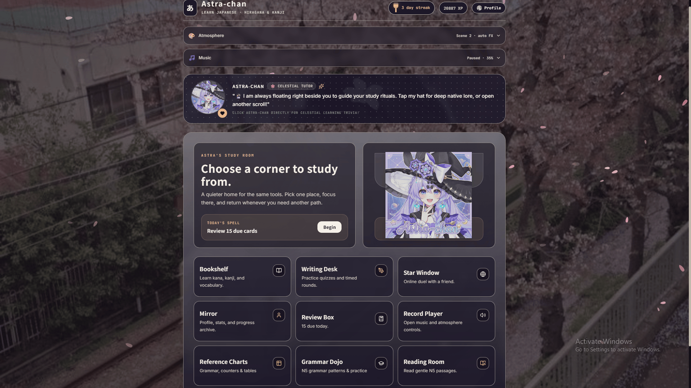

---

## The Story

This didn't start as a project. It started as a small experiment while Ashraful and I were learning Japanese.

I opened Claude and asked it to make a simple quiz. Ashraful was the one who asked, *"Can it add sound effects? Let me try."* It worked, so I tried too. Then came the dangerous question: *"Let's make it bigger. Let's see what it makes."*

That is how a tiny quiz became Astra-chan.

Ashraful and I did not build one app together. We built our own separate apps. We shared plans, features, ideas, and the architecture underneath them. When one of us tried something interesting, the other would borrow the idea, improve it, or argue for a better version. There was no gatekeeping; we regularly pushed each other to take good advice. Astra-chan is my app, but that shared creative pressure is part of its story.

What followed was about a week of intense building — roughly 4 to 5 hours every day, sometimes more. I became completely absorbed in breaking things, fixing them, adding features, redesigning them, and occasionally breaking them again. By the time I first uploaded it to GitHub, around 8 days had passed. Not months. One focused, obsessive week.

I did not write the code line by line myself. I decided what to build, how it should feel, what was worth adding and what was not, when something looked wrong, and when a technically impressive idea would make the app worse for a beginner. The project taught me that knowing *what to ask*, what to reject, and what to test is its own skill.

The app grew from a single HTML file into a full-stack learning space with multiplayer, AI-assisted kanji drawing feedback, spaced repetition, Firebase sync, grammar and reference tools, reading practice, and a mascot companion named **Astra-chan** — whose artwork was generated by Gemini after many, many attempts.

### How I work with AI

I do not treat AI as a vending machine for finished software, or as a tool that disappears once it has produced an answer. I work with several AI collaborators, each useful for different kinds of thinking. Claude has helped with architecture, implementation, and review; Codex has helped with scoped edits, verification, and handoffs; Gemini and Google AI Studio have helped with experiments, data, visual work, and stroke features; other models have been useful for debugging, research, comparison, or design criticism.

The important part is the loop: I set the direction, describe the experience I want, provide the relevant files, test the result in the running app, take screenshots, question confusing behavior, and decide what survives. AI can write a lot of code quickly. It cannot decide what Astra should feel like for a beginner unless I keep making those decisions.

Large changes are divided into named phases. Each phase has a narrow file scope, a handoff, a working copy, and a verification pass. One collaborator may build while another checks the result, but neither replaces my own local testing. I keep recovery copies and old phase archives instead of deleting them. That sounds overly careful until an AI session edits the wrong version, a design needs to be compared with yesterday's design, or a promising change needs to be safely backed out. The context files and handoffs are the project's memory between sessions.

This process is slower than accepting the first generated answer. It is also how a chaotic experiment became an app I can keep improving without losing track of what changed.

Some moments worth mentioning:

- When the background images and music came together for the first time, something clicked. It stopped feeling like a quiz app and started feeling like a *place*.
- Different models kept different parts of the project honest. One would propose a design, another would find the confusing part, and I would test the result before deciding whether either suggestion belonged in the app.
- The multiplayer system took the longest. I checked Firebase guidance with more than one model and researched API-key security before trusting the deployment. Nothing important was accepted just because one model sounded confident.
- The Study Room redesign changed everything. Instead of menus and tabs, the home screen became Astra-chan's room — a Bookshelf, a Writing Desk, a Star Window. Navigation as a place to be, not a list to scroll through.
- Astra-chan now reacts when you go AFK. She wonders about you after 15 seconds of silence, and lights up when you return. Small thing. Feels alive.
- The kanji drawing feedback went through two models. The original used Cloudflare Workers AI with LLaVA 1.5 7B — a vision model that technically worked, but gave vague or inaccurate structural feedback. I switched it to **Google Gemini 3.1 Flash Lite**, which gave feedback specific enough to explain what looked off. The app now combines that optional AI feedback with a separate KanjiVG-based stroke demonstration.

This is still being built. It probably always will be.

### Splitting App.tsx — a case study in AI-directed refactoring

By the time the feature list above was mostly done, `App.tsx` had grown to
**7,625 lines** — one giant component holding ~90 pieces of state and every
screen's JSX in a single function scope. It worked, but it was becoming
impossible to hand to any AI session without burning half the context
window just reading it.

The fix took **9 phases**, each one extracting a single screen
(`menu`, `results`, `vocab-quiz`, `kanji-quiz`, `quiz`, `kanji-scroll`,
`profile`, `review-deck`, `online-multiplayer`) into its own component under
`src/components/`, using plain prop-passing — no Context, no state
libraries, nothing that would risk subtly changing behavior.

The workflow for each phase:
1. One Claude session (the reviewing Claude) reads the current `App.tsx`,
   identifies the next screen's exact line boundaries and every piece of
   state/handler it touches, and writes a detailed, scoped prompt — what to
   read, what *not* to read, what must never move, and the exact output
   format expected.
2. That prompt gets handed to Codex, which does the actual extraction.
3. The result comes back to Claude for verification (line counts, bracket
   balance, cross-screen state checks) before moving to the next phase.

A few things made this harder than "just move the JSX":
- Several screens shared state with each other — `currentKanjiIndex` was
  used both inside the `kanji-scroll` screen and in the mascot companion
  render outside it; the friend-invite system was shared between `profile`
  and `online-multiplayer`. Each had to be identified and kept in `App.tsx`,
  passed down as props to both consumers, rather than moved.
- The `online-multiplayer` screen (the final and biggest phase, ~983 lines)
  had state driven by `useEffect` hooks handling Firebase room
  subscriptions — logic that had to stay in `App.tsx` regardless of where
  the JSX lived, which inverted the usual "move anything self-contained"
  instinct from every earlier phase.
- One early Codex session burned through its usage limit fighting its own
  PowerShell string-escaping and a self-created symlink to an external
  `node_modules` folder, without producing a final result. The fix wasn't a
  cleverer prompt — it was adding an explicit "work efficiently" section to
  every prompt after that: no scripted string replacement, no full
  project-wide lint/build runs chasing unrelated pre-existing errors, do the
  edit once.

End result: `App.tsx` was cut nearly in half, with 9 new screen components and zero behavior changes — verified phase by phase by actually clicking through the app, not just trusting a clean build.

---

## Why I Built This

I am an 18-year-old CST diploma student from Bangladesh, learning Japanese while hoping to study and eventually live in Japan. Japan represents more than a career destination to me: a quieter life, beautiful nature, and a place to breathe. I am aiming toward MEXT scholarship and KOSEN admission.

Building a Japanese learning app while learning Japanese felt like the most honest thing I could do. Astra is designed for the version of me who wants to study seriously, but still needs the experience to feel calm, visual, and a little magical.

---

## Features

### 🏠 Study Room Navigation
The home screen is Astra-chan's room — each object is a destination:
- **Bookshelf** — Learn hiragana, katakana, kanji, and vocabulary
- **Writing Desk** — Practice quizzes and timed rounds
- **Star Window** — Online duel with a friend
- **Mirror** — Profile, stats, and progress archive
- **Review Box** — SRS review deck with live due card count
- **Record Player** — Music and atmosphere controls
- **Reference Charts** — Grammar tables and quick reference
- **Grammar Dojo** — N5 grammar patterns and practice

### 📚 Learning
- **Hiragana & Katakana** — full character grids with pronunciation, flashcard mode, and example words
- **Kanji** — 145 current N5-level single-character cards with meanings, readings, stroke count, and example sentences. A **Digital / Written / Compare** specimen shows the same kanji in a clean gothic font and a handwriting-style font side by side, and a recall mode hides meanings and readings so you can test yourself
- **N5 Vocabulary** — 694 words across 11 categories (greetings, food, places, actions, adjectives, body, weather, and more)
- **Daily Spell** — a suggested next action shown on the home screen each session

<p align="center">
  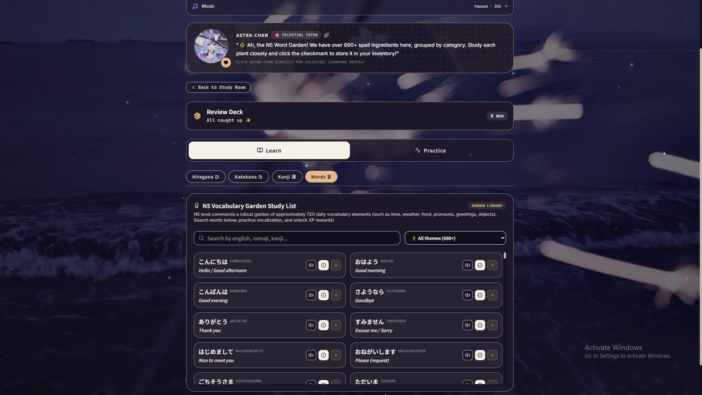
</p>

### 🎯 Practice & Quiz
- **Multiple quiz modes** — multiple choice, romaji typing, survival timer
- **Custom character picker** — select exactly which characters to quiz on, with per-row select/deselect
- **Quiz length selector** — 10 / 20 / 30 / All selected
- **Vocab Quiz** — meaning mode and reading mode with 4-choice answers
- **Kanji Quiz** — meaning mode and reading mode, no category hints (so it actually tests knowledge)
- **Kanji Practice Station** — one card, four modes: **Watch** the strokes, **Trace** over a ghost character, **Write** from memory, then **Review** — optional AI-assisted feedback on your drawing's visual structure, proportion, and balance (it does not claim to judge exact stroke order). An optional practice grid is off by default
- **Stroke Watch** — watch the real, ordered stroke paths for all 145 kanji, with controls for play/pause, stepping, speed, numbering, single-stroke focus, loop, and reduced motion
- **Kanji Word Family** — a deep-dive panel for 13 curated kanji, grouping 64 real vocabulary words by which reading each kanji uses (e.g. 生 across せい in 先生, い in 生きる, なま in 生, and う in 生まれる), with notes for sound changes where useful, pronunciation, and SRS actions. These families are curated learning aids, not exhaustive dictionary entries.

<p align="center">
  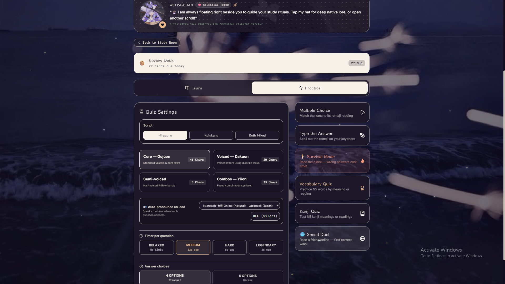
  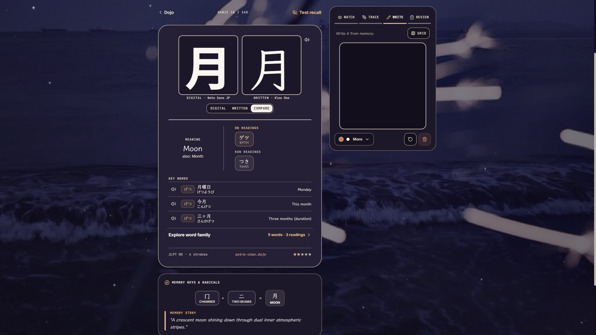
</p>

<p align="center">
  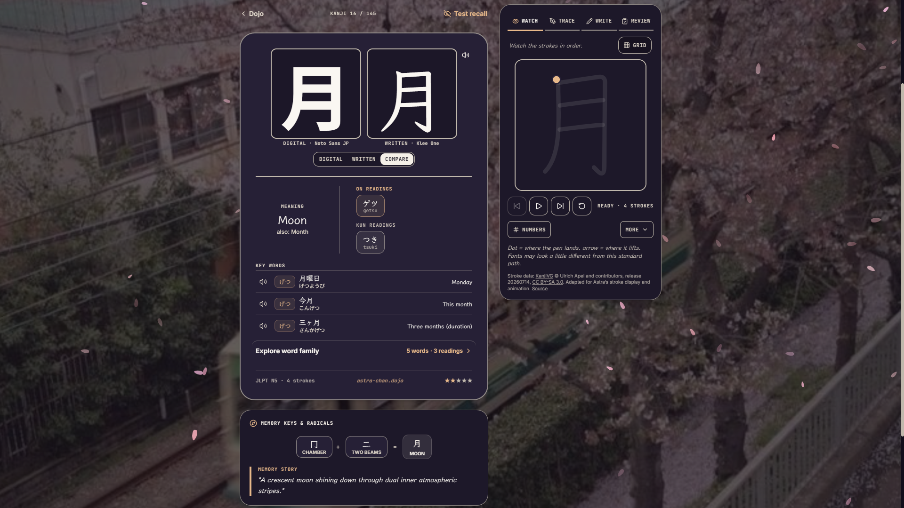
  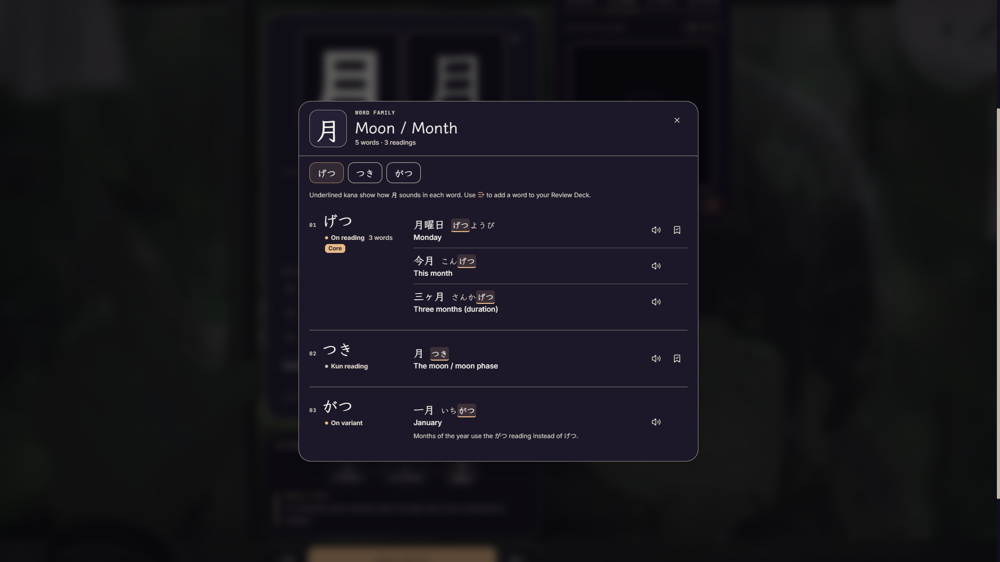
</p>

### 📖 Reading Room
- **N5 Reading Passages** — gentle multi-sentence stories built from the app's Japanese vocabulary and grammar
- **Guided & Immersion Modes** — reveal readings and meanings while learning, or read independently and mark unfamiliar words
- **Tap-to-Explore Words** — inspect readings and meanings directly inside each passage
- **Optional Reading Timer** — choose no limit or a 1 / 3 / 5 / 10 minute session
- **Comprehension Checks** — answer questions after selected N5 passages and review your result
- **Personal Reading Notes** — keep a session list of words you marked as difficult
- **Review Deck Integration** — add individual missed words or all collected words to the SRS Review Deck
- **Astra-chan Reading Companion** — Astra reads alongside you, reacts when called, and returns to her book after a short conversation
- **Future Levels** — N4 through N1 are shown as planned levels and will unlock in future updates

<p align="center">
  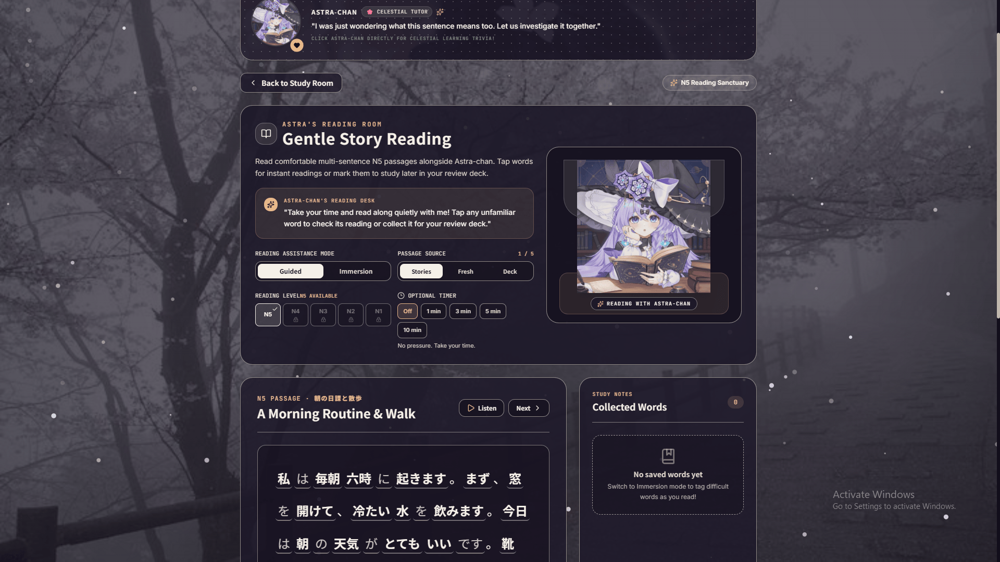
</p>

### 🥋 Grammar Dojo
- **12 Core N5 Grammar Patterns** — detailed structural guides with full explanations, syntax breakdowns, and cultural tips
- **Rich Media Support** — interactive audio pronunciation (🔊 TTS) for all grammar formulas and example sentences
- **Fill-in-the-Blank Quizzes** — dynamic grammar quiz mode to test and solidify your understanding of patterns in context
- **Search & Filter Controls** — instantly query and filter patterns by category, difficulty (Basic vs. Intermediate), or search terms
- **Bilingual Romaji Toggle** — flexible reading displays designed to accommodate both total beginners and advanced learners

<p align="center">
  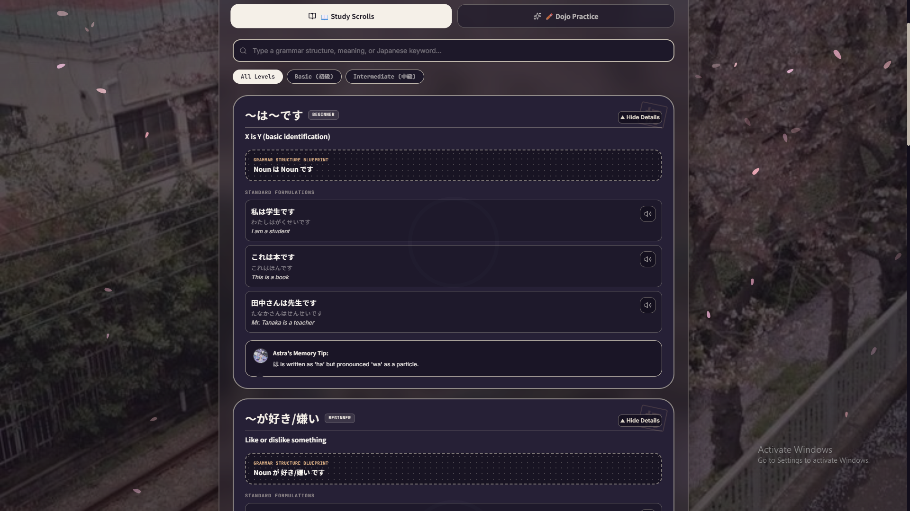
</p>

### 📊 Reference Charts
- **Comprehensive N5 Tables** — beautifully laid-out reference grids covering Japanese numbers, counters, time, verb groups, adjectives, and particles
- **Pronunciation Audio & Romaji** — quick-access audio buttons and romaji visibility options for every row
- **Tricky Counting & Euphonic Rules** — clear explanations for complex phonetic modifications (e.g., ふん vs ぷん, irregular days of the month, and counting exceptions)
- **Natural Conversation Phrases** — 50+ common expressions such as うん, どうしよう？, え、ほんと？, おつかれ！, やばい, and めっちゃ, with romaji, English meaning, register labels, usage notes, caution notes, and pronunciation audio
- **Phrase Search & Filters** — search by Japanese, romaji, or meaning and filter by casual, polite, neutral, slang, or conversation category
- **Conversation Examples** — selected phrases include short Japanese dialogues with English glosses to show how they sound in context

<p align="center">
  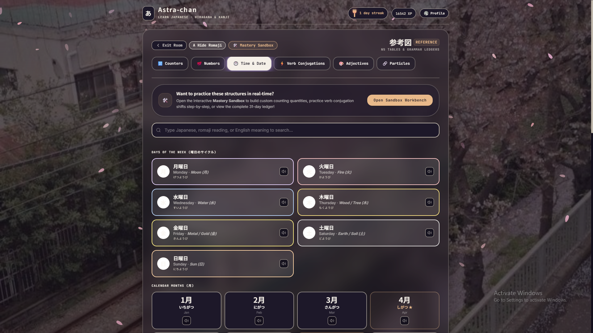
</p>

### 🛠️ Interactive Mastery Sandbox
- **Dynamic Quantity Builder** — select any number and match it with N5 counter categories (pens, animals, people, etc.) to view automatic euphonic sound modifications and explanations
- **Step-by-Step Verb Worksheet** — conjugate root verbs live by applying past, negative, polite, or negative-te suffixes, seeing conjugations react instantly
- **Immersive 31-Day Ledger** — a complete interactive calendar visualizer to review irregular monthly date readings and listen to natural audio pronunciations

<p align="center">
  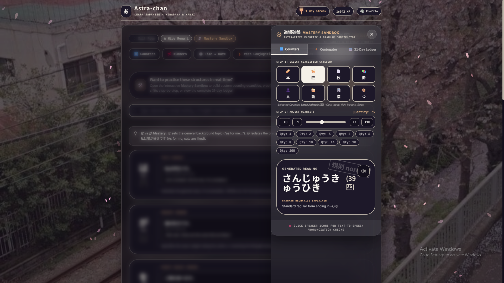
</p>

### 🔁 Spaced Repetition (SRS)
- Add any word or kanji to your personal Review Deck
- Cards resurface on a 6-level interval system (8h → 1d → 3d → 7d → 14d → 30d)
- Wrong answers pull cards back; correct answers push them forward
- Due count shown live on the home screen Review Box
- XP awarded for every card reviewed

### 🌐 Online Multiplayer
- Create or join rooms with a 6-character room code
- **Competitive mode** — same question for both players; first correct answer steals the point
- **Parallel mode** — each player answers independently; winner decided by accuracy % and average speed
- Custom character picker for online rooms
- Configurable question count (10 / 20 / 30 / All)
- Configurable difficulty (Easy 15s / Medium 10s / Hard 5s / Super Hard 3s)
- Two-way friend request system with accept/decline flow
- Friend request notifications from the profile button
- Room invites with response tracking
- Recent duel history saved after completed online matches
- Play Again / rematch flow using the same room and players
- Live lobby with player avatars and online/offline status dots
- **Authenticated answer attribution** — submitted answers derive the host/guest role and display name from the Firebase UID and room state instead of trusting browser-supplied role data

### 👤 Profile, Voice Control & Bilingual Support
- **Optional Cloud Account** — create an account with email/password or Google from the visible account shortcut or Profile; the existing anonymous Firebase identity is upgraded without changing the user's friend code when possible
- **Cloud Progress Sync** — XP, streaks, mastery, vocabulary progress, SRS cards, study dates, survival records, and reading notes sync to the user's private Firebase progress record
- **Account Recovery** — email/password users can request a Firebase password-reset link without visiting the Firebase Console
- **Offline Fallback** — local browser storage remains available when the user is not signed in or temporarily offline; account preferences such as theme, font, and browser-provided voice remain device-specific
- **Dual-Language Interface** — complete bilingual support! Toggle the entire application interface between English and Japanese with a single click
- **Hybrid Japanese Voice Engine** — choose fixed Gemini Japanese voices from Astra's catalog, or use browser voices for free/offline playback; Gemini audio falls back to the browser engine when unavailable
- **Monthly Study Calendar** — detailed tracking calendar showing daily active study streaks, streak counts, and XP milestones
- **Mastery Badges** — earn 10 distinct unlockable achievement badges celebrating your progress (e.g., *First Steps*, *Survivor*, *Week Warrior*, *Deck Master*, *N5 Scholar*)
- **Durable Backup/Restore** — download all stats, vocabulary decks, and unlocked milestones to a JSON file and restore your state at any time
- **Recent Duels** — online match history showing opponent, score, result, date, difficulty, mode, and round count
- **Friend Request Inbox** — accept/decline requests from Profile, with a visible notification badge when new requests arrive

<p align="center">
  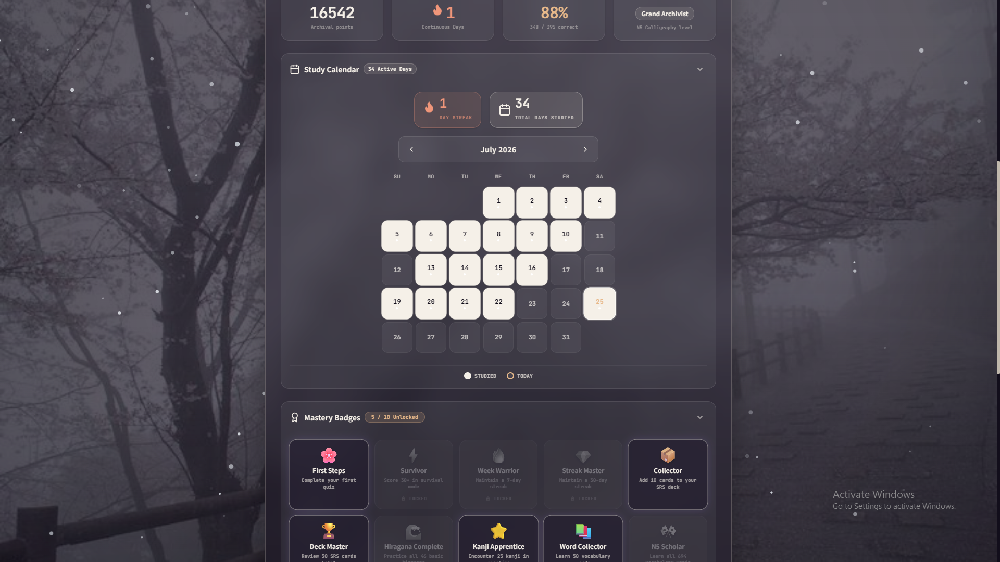
  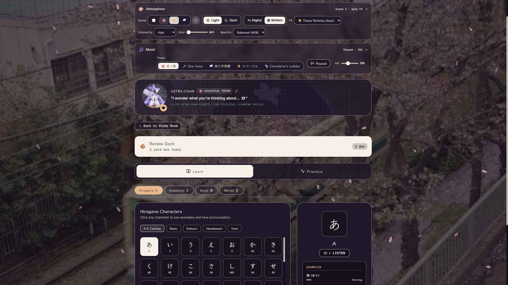
</p>

### 🎨 Atmosphere & Mascot
- **5 Animated Background Scenes** — dynamic visual themes depicting different times of day and seasons
- **Tailored Weather & Magic Particles** — cozy falling snow, delicate cherry blossom (sakura) petals, glowing magical sparkles, gentle rain, and floating Japanese runes
- **Fluid Crossfade Transitions** — a physics-based, continuous lerped canvas transition system that gracefully crossfades particle states during scene switches (no sudden jumps, especially between snow and cherry blossoms!)
- **Auto-Cycle Scenes Mode** — a cozy toggle option to cycle through the beautiful background scenes automatically every minute, with persistence saved in local storage
- **Atmosphere controls** — 5 gorgeous music tracks, custom background blur, opacity, and intensity controls
- **Theme & Fonts** — 6 full visual themes (Light, Dark, 🔮 Cosmic Witch, 🎋 Emerald Jade, 🍁 Autumn Maple, 🌌 Cyber Tokyo), each with its own color palette and matching shift in Astra-chan's personality and dialogue, plus a premium typography selector (Noto Sans JP / Klee One)

<p align="center">
  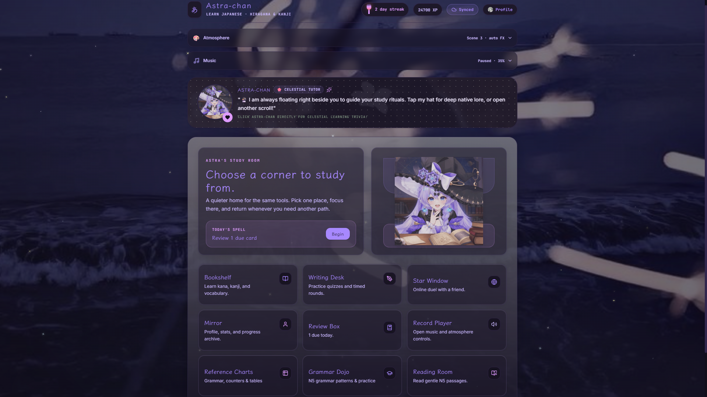
</p>

- **Astra-chan** — animated mascot with mood system, speech bubbles, and AFK reactions:
  - Goes wondering after 15 seconds of no interaction
  - Goes into deep AFK mode after 3 minutes
  - Lights up with excitement when you return
  - Five artwork states with smooth crossfade transitions: default, wondering while you are away, excited when you return, reading, and reading-clicked

---

## Tech Stack

| Layer | Technology |
|---|---|
| Frontend | React 19 + TypeScript |
| Build | Vite |
| Styling | TailwindCSS v4 |
| Animation | Framer Motion |
| Database | Firebase Realtime Database |
| Auth | Firebase Anonymous Auth + optional Email/Password and Google accounts |
| Voice | Browser Speech Synthesis + optional Gemini TTS |
| AI Feedback | Google Gemini 3.1 Flash Lite (optional vision feedback) |
| Stroke Data | KanjiVG-derived stroke paths (CC BY-SA 3.0) |
| Deployment | Vercel (serverless functions for API proxy) |
| Icons | Lucide React |

## Credits & Licenses

- **Astra's own code and content** are covered by the [LICENSE](LICENSE) in this repository (All Rights Reserved — personal use permitted).
- Astra-chan's artwork was generated with Gemini.

### Third-party data and attribution

The stroke demonstrations use adapted **KanjiVG** data by Ulrich Apel and contributors from the
20260714 release. The KanjiVG-derived data is released under the [Creative Commons Attribution-ShareAlike 3.0
license](https://creativecommons.org/licenses/by-sa/3.0/). Astra's stroke display and animation
are adaptations for this app; the original project and source are linked from the in-app notice and
the `src/kanjiStrokes/NOTICE.md` file.

- [KanjiVG source repository](https://github.com/KanjiVG/kanjivg)
- [KanjiVG project site](https://kanjivg.tagaini.net/)
- [CC BY-SA 3.0 license](https://creativecommons.org/licenses/by-sa/3.0/)

This notice applies to the KanjiVG-derived stroke data, not automatically to every part of Astra. The stroke data can be regenerated with `npx tsx scripts/build-kanji-strokes.ts` (the script's header explains the arguments).

---

## AI collaboration

This project was built through AI collaboration, but not through blind automation. I directed the product, made the design calls, tested the running app, compared competing suggestions, and kept the final say. The models wrote much of the code; I owned the decisions and the responsibility for what stayed.

| Collaborator | How it contributed |
|---|---|
| **Claude** | Architecture, implementation, visual experiments, and phase verification |
| **Codex** | Scoped edits, independent review, regression checks, and handoff documents |
| **Google AI Studio + Gemini** | Early builds, kanji/vocabulary work, Astra-chan artwork, visual experiments, and optional kanji feedback |
| **Kimi** | Additional debugging and bug-finding passes |
| **ChatGPT, DeepSeek, Grok, Perplexity, Netlify, Copilot, Openclaw, Codeium, OneCompiler** | Research, comparison, deployment guidance, technical references, isolated checks, and alternative perspectives |
| **Lovable** | Design exploration and an early profile prototype |
| **Qoder** | UI design exploration for the kanji study flow |

The list matters less than the method: describe a real goal, give the collaborator only the necessary context, inspect what it returns, run it, look at it, and decide whether it actually helps a learner. A confident answer is not the same thing as a verified answer.


---

## What I Learned

- How to break a large problem into phases small enough for an AI to handle reliably
- That a prompt isn't memory — plans, context files, and handoffs are what let a brand-new chat pick up where the last one stopped
- When to trust an AI's output and when to verify it with a different one
- That "it passed" and "it's right" are different sentences — a clean build can't tell you whether the screen actually looks right
- That design decisions, product decisions, and debugging instincts can't be delegated — those stayed with me
- That building something for yourself, for a real reason, makes every frustrating session worth it
- That the best portfolio piece isn't the most technically impressive one — it's the one with a real story behind it
- That one focused week, if you care enough, can produce something you're genuinely proud of

---

## Setup (Local Development)

> **Known requirements:** multiplayer needs Firebase Realtime Database and Firebase Anonymous Auth. Cross-device progress sync additionally requires Firebase Email/Password or Google Auth and the private `userProgress/$uid` database rule. Kanji-drawing AI feedback and the optional fixed Gemini voice catalog use the server-side Google Gemini API key; browser voices remain available without it.

```bash
git clone https://github.com/late-shine/astra-chan-app.git
cd astra-chan-app
npm install
cp .env.example .env
# Fill in your Firebase and Gemini API keys
npm run dev
```

### Environment Variables
```
VITE_FIREBASE_API_KEY=
VITE_FIREBASE_AUTH_DOMAIN=
VITE_FIREBASE_PROJECT_ID=
VITE_FIREBASE_DATABASE_URL=
VITE_FIREBASE_STORAGE_BUCKET=
VITE_FIREBASE_MESSAGING_SENDER_ID=
VITE_FIREBASE_APP_ID=
GEMINI_API_KEY=
GEMINI_TTS_MODEL=gemini-2.5-flash-preview-tts
```

Enable **Email/Password** and **Google** under Firebase Console → **Authentication → Sign-in method** if you want account creation and cloud progress sync. Password-reset emails use Firebase Authentication's built-in email action and can be customized under **Authentication → Templates**. Apply the complete rules from `database.rules.json` to Firebase Realtime Database. The `userProgress/$uid` path is private to the authenticated owner.

When using the Firebase CLI, publish database rules with:

```bash
firebase deploy --only database
```

For the fixed Astra Gemini voice catalog, add the same server-side `GEMINI_API_KEY` to the local `.env` file and Vercel Environment Variables. `GEMINI_TTS_MODEL` is optional and defaults to `gemini-2.5-flash-preview-tts`. Never use a `VITE_` prefix for the Gemini key. If Gemini TTS is unavailable or its quota is reached, Astra automatically falls back to the browser voice engine.

> Get a free Gemini API key at [aistudio.google.com](https://aistudio.google.com). Gemini limits vary by model, project, and time window; if the voice quota is reached, Astra automatically uses the browser voice instead.

> ⚠️ **AI drawing analysis limit:** The free Gemini tier resets daily. If Astra-chan's drawing checker stops responding, the day's quota has been reached — it'll be back the next day automatically.

### Firebase Realtime Database Paths

Online multiplayer and account sync use Firebase Authentication and these Realtime Database paths:

- `rooms`
- `friends`
- `friendRequests`
- `invites`
- `inviteResponses`
- `matchHistory`
- `userProfiles`
- `userProgress` — private study-progress record for each signed-in account

`matchHistory` starts recording only after a completed online duel. Older matches will not appear retroactively.

### Multiplayer security boundary

V1 protects authentication, room membership IDs, invite ownership, profiles, and private progress records. Answer attribution is derived from `auth.uid` rather than a client-provided role. The quiz result and timing are still reported by the client, and room updates use client transactions, so a determined user with a modified browser can cheat. That boundary is acceptable for friendly matches; a tournament-grade anti-cheat system would need server-authoritative scoring.

---

## Roadmap

- [x] Study Room visual redesign (navigation as Astra-chan's room)
- [x] Reference Charts (counters, particles, verb groups, adjectives, time)
- [x] Natural Conversation Phrases in Reference Charts with register filters and usage examples
- [x] Grammar Dojo with N5 patterns and fill-in-the-blank practice
- [x] Spaced Repetition System (SRS)
- [x] Online multiplayer — competitive and parallel modes
- [x] Optional email/password and Google accounts with Firebase cloud progress sync and password recovery
- [x] Hybrid Japanese voice system with fixed Gemini TTS voices and browser fallback
- [x] Vocab and Kanji quiz modes with custom picker
- [x] Streak calendar and achievement badges
- [x] Progress backup and restore
- [x] Astra-chan mascot states: default, wondering/AFK waiting, excited return, reading, and reading-clicked artwork
- [x] Kanji drawing feedback — originally Cloudflare Workers AI (LLaVA 1.5 7B), upgraded to **Gemini 3.1 Flash Lite** after accuracy issues with the original model
- [x] Romaji toggle for beginners across Grammar Dojo and Reference Charts
- [x] App component splitting across 9 phases (described above; later features continued to evolve `App.tsx`)
- [x] Interactive Mastery Sandbox (counter builder, verb conjugation worksheet, 31-day calendar ledger — built as interactive tools rather than literal user-created tables)
- [x] Kanji Word Family panel (reading-grouped vocabulary deep-dive, 13 curated kanji and 64 words so far)
- [x] KanjiVG stroke demonstrations with attribution and reduced-motion support
- [x] Beginner-focused UI simplification pass for the kanji study screen and word-family panel
- [x] Kanji study screen overhaul — clearer card, Digital/Written/Compare specimen, practice station (Watch / Trace / Write / Review)
- [x] Cleaner kanji data — audit script, structured reading records, high-confidence reading fixes
- [x] 6-theme visual system (Light, Dark, Cosmic Witch, Emerald Jade, Autumn Maple, Cyber Tokyo)
- [x] Reading Room with N5 passages, Guided/Immersion modes, optional timers, comprehension checks, and SRS notes
- [x] Two-way friend request system with accept/decline flow and profile notifications
- [x] Online duel match history
- [x] Same-room rematch / Play Again flow
- [x] Auth-derived multiplayer answer attribution
- [ ] Kanji Word Family reading drill quiz
- [ ] N4 vocabulary expansion
- [ ] Mobile app version

---

## Built By

**Shahriya** — CST Diploma student, Bangladesh, 18

Astra-chan is my app. Ashraful is my friend, fellow Japanese learner, and the person who asked
*"what if we make it bigger?"* at the beginning. We built separate apps, but shared ideas,
architecture, criticism, and encouragement without gatekeeping.

The code was developed with AI collaborators. The direction, testing, design judgment, and final
decisions stayed with me.

*"I would rather try and fail than never try at all."*

---

<p align="center">
  Made with 🌸 lots of green tea and way too many AI chat windows
</p>
